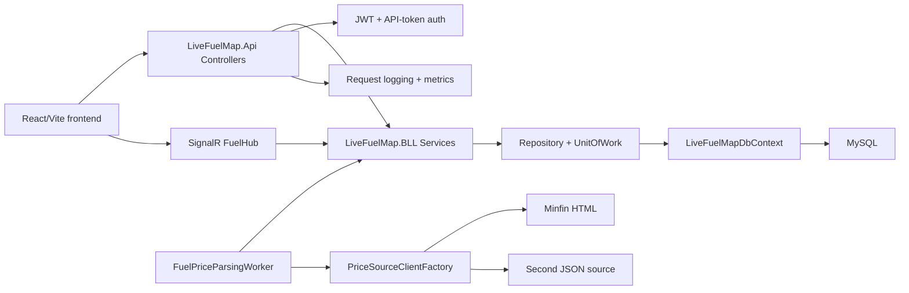

# Architecture

## Key Contracts

- Public read endpoints: `GET /api/stations`, `GET /api/fuels`, `GET /api/fuel-prices/history`.
- JWT endpoints: `POST /api/auth/register`, `POST /api/auth/login`, `GET /api/auth/verify`.
- JWT protected endpoints: `POST /api/subscriptions`, `POST /api/compare`.
- Admin endpoints: `/api/admin/users`, `/api/admin/api-tokens`, `/api/admin/data-sources`, `POST /api/fuel-prices/corrections`.
- API-token endpoint: `GET /api/external/current-prices`.
- SignalR: `/hubs/fuel`, event `fuelDataUpdate`, methods `GetFuelData`, `GetPriceHistory`.

## Fuel ID Fix

Legacy code mixed `fuel_id` meanings. The new API returns stable fuel `code` values:

- `a95plus` for `А 95+`
- `a95` for `А 95`
- `a92` for `А 92`
- `diesel` for `ДП`
- `gas` for `Газ`

The frontend renders by `fuelCode` and `pricesByFuelCode`, not by hard-coded numeric IDs.
