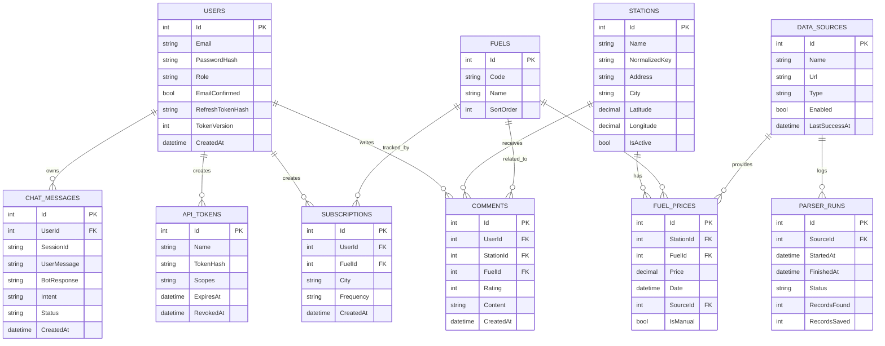
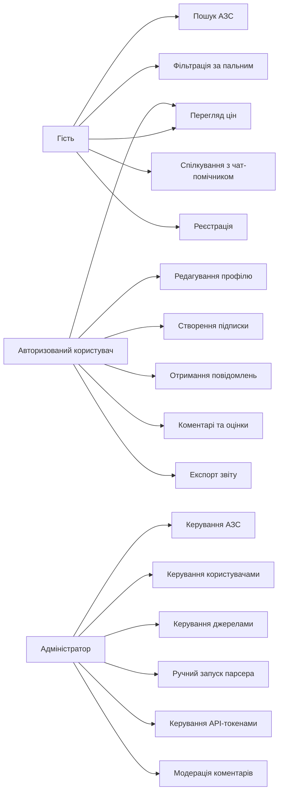
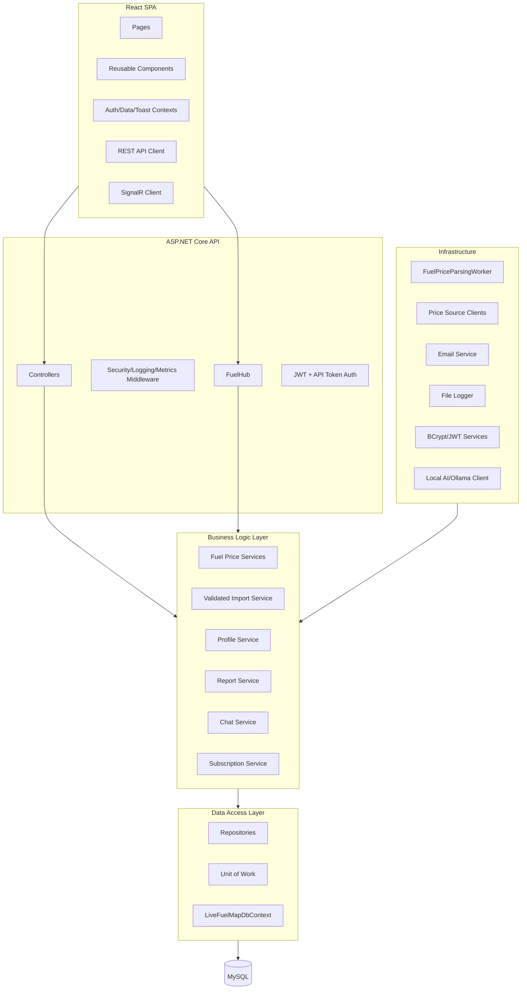
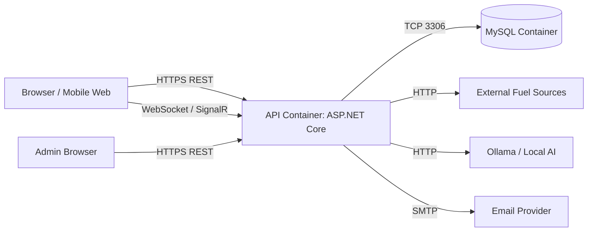
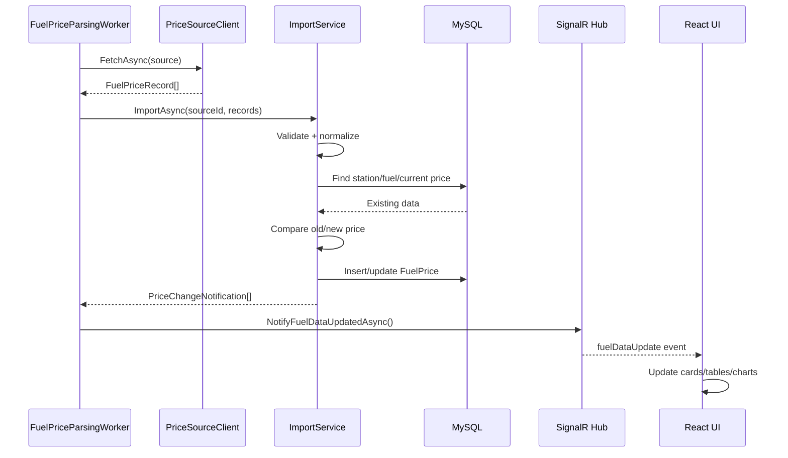
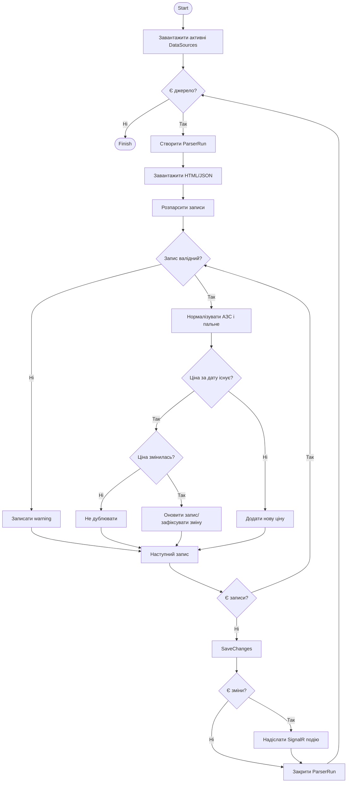
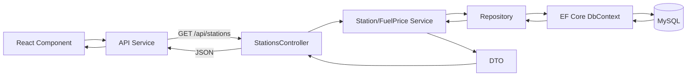
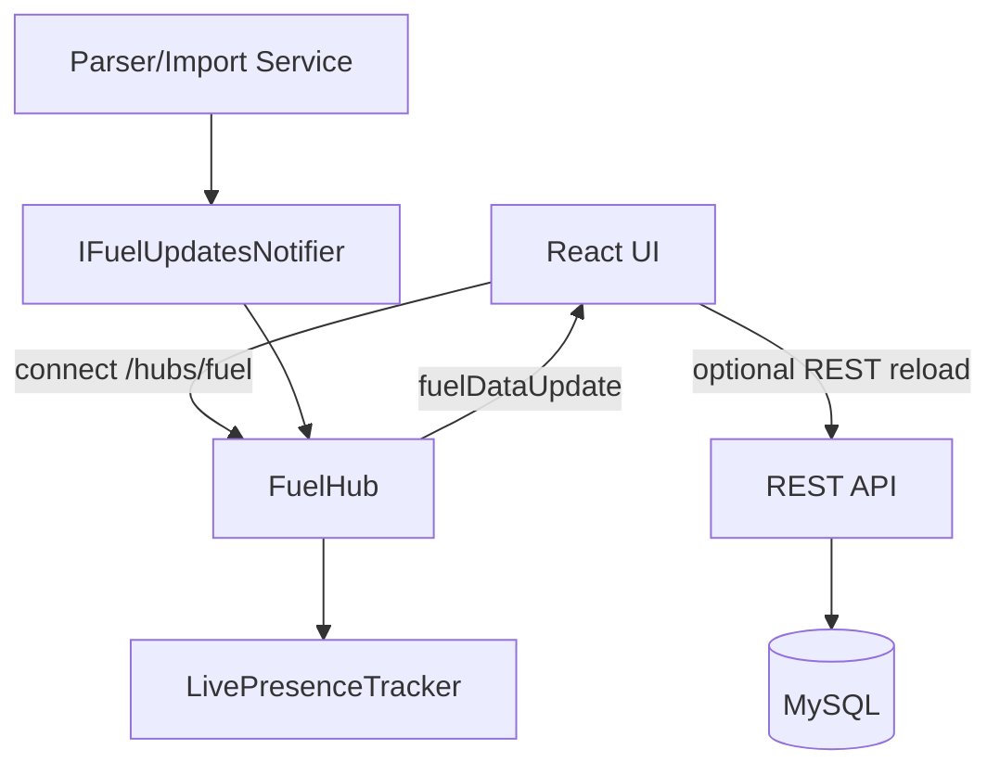

# Додатковий технічний аналіз системи LiveFuelMap

Цей документ є розширенням основного тексту дипломної роботи та містить поглиблений аналіз аналогів, діаграмне моделювання, алгоритми роботи ключових підсистем, приклади SQL/API/DTO/коду, обґрунтування архітектурних рішень, аналіз продуктивності, розділ безпеки та окремий підрозділ про інтелектуального чат-помічника LiveFuelMap.

Усі розділи, які описують архітектуру LiveFuelMap, сформульовано відносно фактично реалізованого проєкту: React/Vite frontend, ASP.NET Core Web API, EF Core, MySQL, SignalR, JWT, BCrypt, Docker Compose, фоновий парсер, адмін-панель, API-токени, підписки, чат-помічник і automated tests. Формулювання про подальше розширення винесено тільки в перспективні або порівняльні підрозділи.

## 26. Аналіз існуючих аналогів та конкурентів

### 26.1. Мета аналізу аналогів

Перед розробкою LiveFuelMap було доцільно проаналізувати наявні рішення, які частково вирішують задачу пошуку або моніторингу цін на пальне. Такий аналіз дозволяє визначити, які функції вже існують на ринку, які обмеження мають конкурентні продукти, які сценарії залишаються недостатньо покритими та за рахунок яких архітектурних рішень LiveFuelMap може мати практичну перевагу.

У межах аналізу розглянуто декілька категорій аналогів:

- офіційні сайти окремих мереж АЗС;
- агрегатори цін на пальне;
- автомобільні портали з розділом цін;
- професійні B2B-сервіси моніторингу;
- внутрішні мобільні застосунки мереж АЗС;
- потенційні data API для сторонніх інтеграцій.

Джерела для аналізу: сторінки цін та ринків Minfin, сторінка паливної аналітики AUTO.RIA, сторінка послуги моніторингу ДП «Держзовнішінформ», офіційні сайти OKKO та WOG.

### 26.2. Офіційні сайти окремих мереж АЗС

Офіційні сайти мереж АЗС, наприклад OKKO та WOG, орієнтовані передусім на власну екосистему. Вони надають інформацію про пальне, акції, програми лояльності, карти заправок, додаткові сервіси, кафе, оплату, мобільні застосунки та корпоративні пропозиції. Наприклад, сайт OKKO показує власні види пального, програму Fishka, акції та інші сервіси мережі. Сайт WOG акцентує увагу на WOG PRIDE, WOG PAY, онлайн-магазині, карті АЗК та сервісах мережі.

Перевага таких сайтів полягає в офіційності інформації. Дані надходять безпосередньо від мережі, тому користувач може довіряти опису продуктів і умовам програми лояльності. Проте такі рішення мають принципове обмеження: вони не порівнюють різні мережі між собою. Користувач, який хоче знайти найвигіднішу ціну у місті, змушений відкривати декілька сайтів або застосунків, вручну порівнювати ціни та враховувати розташування АЗС.

Недоліки офіційних сайтів окремих мереж:

- інформація обмежена однією мережею;
- немає повноцінного незалежного порівняння з конкурентами;
- фільтри за іншими операторами відсутні;
- історія цін зазвичай не є основним сценарієм;
- API для стороннього доступу часто відсутній або не є публічним;
- користувач не отримує єдиного dashboard для всіх АЗС;
- аналітика орієнтована на маркетинг мережі, а не на нейтральний ринковий аналіз.

LiveFuelMap вирішує цю проблему за рахунок агрегованої моделі: система зберігає АЗС різних мереж в одній базі даних, нормалізує типи пального, надає єдині фільтри та дозволяє порівнювати ціни незалежно від бренду.

### 26.3. Агрегатори та автомобільні портали

Агрегатори, такі як Minfin, публікують сторінки з цінами на бензин, дизпаливо та газ на АЗС України, а також дають зрізи за областями та провідними операторами. AUTO.RIA має сторінку з середніми цінами на пальне в регіонах України, динамікою зростання або зниження цін та посиланням на джерело даних. Такі портали є корисними для загального огляду ринку.

Основна перевага агрегаторів полягає у ширшому охопленні, ніж у сайтів окремих мереж. Користувач може швидко побачити середні ціни, порівняти області та отримати загальне уявлення про ситуацію. Проте ці сервіси часто не фокусуються на повноцінній інтерактивній роботі користувача: персональних підписках, real-time оновленнях, API-токенах, адмін-модерації джерел, чат-помічнику, розширеній фільтрації, сценаріях профілю та інтеграції з власною системою повідомлень.

Недоліки типових агрегаторів:

- обмежена персоналізація;
- не завжди є деталізація до рівня конкретної АЗС;
- API для дипломного або стороннього інтеграційного сценарію може бути недоступним;
- немає власного адміністративного циклу керування джерелами;
- користувач зазвичай не може створити підписку на зміну конкретного типу пального;
- real-time взаємодія не є основним принципом роботи;
- відсутній інтелектуальний чат-помічник, який працює з контекстом запитів.

LiveFuelMap розглядає моніторинг цін не як статичну інформаційну сторінку, а як повноцінний вебсервіс з API, особистим кабінетом, аналітикою, історією, real-time подіями та адміністративним контролем.

### 26.4. Професійні B2B-сервіси моніторингу

ДП «Держзовнішінформ» пропонує послугу щоденного моніторингу цін на роздрібному ринку України на понад 4000 АЗС, зокрема у форматі Excel та із показниками мінімальної, максимальної та середньої ціни. Такий підхід є корисним для бізнесу, закупівель, аналітичних відділів та організацій, яким потрібен масив даних.

Проте B2B-моніторинг не завжди підходить для звичайного кінцевого користувача. Він може бути платним, орієнтованим на Excel-звіти, менш інтерактивним і не призначеним для швидкого mobile-first перегляду. LiveFuelMap, навпаки, поєднує аналітичну складову з доступним вебінтерфейсом.

### 26.5. Уточнений аналіз запропонованих сайтів-аналогів

Окремо було розглянуто чотири сайти, які є найближчими аналогами LiveFuelMap за предметною областю: Minfin, Все АЗС, AUTO.RIA та myLPG.eu. Ці сервіси мають спільну ознаку - вони працюють з інформацією про вартість пального, однак кожен із них має інший фокус, іншу глибину даних та інший користувацький сценарій.

**Minfin, сторінка детальних цін на пальне.** Сторінка Minfin `index.minfin.com.ua/markets/fuel/detail/` публікує детальні дані по паливному ринку України за областями та операторами. На сторінці вказується дата останнього оновлення, є розподіл за областями, операторами та типами пального: А-95+, А-95, А-92, ДП, газ. Важливо, що Minfin зазначає походження даних від партнера - Консалтингової групи А-95, а також попереджає, що в деяких операторів ціни на різних АЗС можуть встановлюватися індивідуально і відрізнятися від наведених на сайті.

З погляду дипломного аналізу Minfin є сильним аналогом за повнотою ринкових даних. Його переваги - велике охоплення областей, прив'язка до операторів, регулярне оновлення та наявність ринкового контексту. Недоліки щодо LiveFuelMap - відсутність власного персонального кабінету саме для моніторингу пального, відсутність користувацьких підписок у межах паливного сценарію, відсутність інтерактивного чат-помічника, відсутність власної адмін-панелі для демонстрації дипломної системи, а також те, що сторінка більше схожа на довідково-аналітичний індекс, ніж на спеціалізований full-stack вебсервіс з real-time архітектурою.

**Все АЗС.** Сайт `vseazs.com` позиціонується як сервіс цін на бензин, дизельне пальне і газ на заправках України. На сторінці є вибір областей, вибір операторів, типи пального, мінімальна, максимальна та середня ціна, а також автокалькулятор. Окремо вказано примітку, що ціни на пальне на заправках можуть відрізнятися від наведених на сайті. Це важливе уточнення, оскільки воно показує типову проблему сервісів-моніторингів: дані можуть бути агрегованими або отриманими з відкритих джерел, але не завжди гарантують точність на конкретній АЗС у конкретний момент.

Перевага Все АЗС - простий доступ до середніх, мінімальних і максимальних цін, наявність автокалькулятора та підтримка різних областей і брендів. Недоліки - застарілий або менш сучасний UX/UI, обмежені можливості персоналізації, відсутність повноцінної авторизації користувача, підписок, SignalR/WebSocket оновлень, адміністративної панелі джерел, відкритої API-архітектури та чат-помічника. LiveFuelMap розвиває схожу ідею, але реалізує її в сучасній SPA-архітектурі з REST API, real-time оновленнями та модульним backend.

**AUTO.RIA, сторінка цін у Харкові.** Сторінка `auto.ria.com/uk/toplivo/kharkov/` показує середню ціну на пальне в Харківській області, дату оновлення, типи пального, динаміку, розрахунок витрати пального, щотижневий моніторинг цін і регіональну таблицю. AUTO.RIA є великим автомобільним порталом, тому розділ цін на пальне є частиною ширшої екосистеми, пов'язаної з автомобілями, оголошеннями, новинами та відгуками.

Перевага AUTO.RIA - велика аудиторія, зручна регіональна сторінка, наявність середніх цін, динаміки та калькулятора витрат. Недолік у контексті LiveFuelMap полягає в тому, що паливний моніторинг не є центральною функцією всього продукту. Дані подані переважно як агреговані середні значення, а не як повноцінна система керування АЗС, джерелами, підписками, API-токенами, чат-ботом і real-time оновленнями. LiveFuelMap є вужчим за тематикою, але глибшим за функціональністю саме в домені моніторингу пального.

**myLPG.eu.** Сайт `mylpg.eu/ru/stantsii/ukraina/tseny/` орієнтований на LPG-тематику та показує графік середніх цін на пальне в Україні з часом. На сторінці є статистика цін, останні середні ціни для LPG, неетильованого бензину та дизелю, графіки за минулий рік і за весь час, рекордні мінімальні та максимальні ціни, підписка на розсилку та мобільний застосунок.

Перевага myLPG.eu - сильна спеціалізація на LPG, міжнародний контекст, графіки за довгий період, мобільний застосунок і супутні LPG-функції, наприклад карта LPG-станцій, планувальник маршруту та інформація про адаптери. Недолік для задачі LiveFuelMap - сервіс не сфокусований саме на українських мережах АЗС як full-stack система моніторингу різних типів пального з адмін-панеллю, JWT-авторизацією, API, локальним AI-чатом і real-time оновленнями. LiveFuelMap може запозичити сильну сторону myLPG.eu - історичні графіки й мобільний напрям, але застосувати їх ширше до всіх типів пального та користувацьких сценаріїв.

### 26.6. Порівняльна таблиця аналогів

**Таблиця 26.1 - Порівняння LiveFuelMap з аналогами**

| Критерій | OKKO/WOG | Minfin detail | Все АЗС | AUTO.RIA Харків | myLPG.eu | Держзовнішінформ | LiveFuelMap |
|---|---:|---:|---:|---:|---:|---:|---:|
| Дані по декількох мережах | Ні | Так | Так | Так | Частково | Так | Так |
| Регіональний зріз | Через карту | Так | Так | Так | Рівень країни | Так | Так |
| Дані по конкретних операторах | Лише власний | Так | Так | Частково | Обмежено | Так | Так |
| А-95/А-95+/А-92/ДП/газ | Власні продукти | Так | Так | Так | LPG/бензин/дизель | Так | Так |
| Мінімальна/середня/максимальна ціна | Ні | Частково | Так | Середня/динаміка | Середня/рекордна | Так | Так |
| Історичні графіки | Обмежено | Частково | Обмежено | Так | Так | У звітах | Так |
| Калькулятор витрат | Ні | Ні | Так | Так | Так, LPG-економія | Ні | Так/може розширюватися |
| Персональні підписки на зміну цін | Лише в межах програм лояльності | Ні | Ні | Розсилка | B2B-розсилка | Так |
| Real-time оновлення UI | Ні | Ні | Ні | Ні | Ні | Ні | Так, SignalR |
| REST API для власного frontend | Не публічно | Не основний сценарій | Ні | Ні | Ні | Ні | Так |
| API-токени для сторонніх сервісів | Ні | Ні | Ні | Ні | Ні | Ні | Так |
| Адмін-панель джерел і парсера | Внутрішня | Ні | Ні | Ні | Ні | Внутрішня | Так |
| Чат-помічник з контекстом | Ні | Ні | Ні | Ні | Ні | Ні | Так |
| Профіль користувача саме для паливного моніторингу | У межах мережі | Ні | Ні | Ні | Ні | Ні | Так |
| Сучасна SPA-архітектура | Частково | Ні/частково | Ні | Так | Частково | Ні | Так |
| Docker-ready демонстраційна архітектура | Ні | Ні | Ні | Ні | Ні | Ні | Так |
| Придатність для дипломної демонстрації повного циклу | Обмежено | Обмежено | Обмежено | Обмежено | Обмежено | Обмежено | Висока |

### 26.7. Переваги LiveFuelMap порівняно з аналогами

LiveFuelMap має перевагу не через одну окрему функцію, а через поєднання декількох архітектурних і продуктових рішень. Сервіс агрегує дані з різних джерел, нормалізує їх у єдину модель, зберігає історію, надає REST API, дозволяє будувати графіки, підтримує real-time оновлення, має адмін-панель і систему користувацьких підписок.

Найважливішими перевагами є:

- незалежність від однієї мережі АЗС;
- єдина структура даних для різних операторів;
- нормалізація різних назв пального та АЗС;
- історичне збереження цін;
- підписки та повідомлення;
- можливість експорту;
- адміністративний контроль якості;
- API для майбутніх інтеграцій;
- чат-помічник, який розуміє контекст діалогу;
- архітектура, готова до масштабування на інші міста, джерела та мобільні клієнти.

## 27. Діаграмне моделювання системи

У цьому розділі наведено діаграми, які можна використати як основу для рисунків у дипломній роботі. Mermaid-діаграми можна експортувати у PNG/SVG через Markdown preview, Mermaid Live Editor або інструменти документації.

### 27.1. ER-діаграма бази даних

**Місце для рисунка 27.1 - ER-діаграма бази даних LiveFuelMap**



Технічне пояснення до рисунка 27.1: ER-діаграма показує нормалізовану структуру даних. Таблиця `FuelPrices` не дублює назви станцій або пального, а посилається на `Stations` і `Fuels`. Це зменшує дублювання та підтримує цілісність. Таблиця `ParserRuns` дозволяє відстежувати якість вебскрапінгу, а `ChatMessages` зберігає історію діалогу окремо за `SessionId` та `UserId`.

### 27.2. Use Case Diagram

**Місце для рисунка 27.2 - Use case diagram LiveFuelMap**



Технічне пояснення до рисунка 27.2: діаграма демонструє три групи акторів. Гість має доступ до публічних сценаріїв, авторизований користувач - до персональних функцій, адміністратор - до керування даними та інфраструктурою. Backend додатково перевіряє роль користувача, тому захист не залежить лише від frontend.

### 27.3. Component Diagram

**Місце для рисунка 27.3 - Component diagram**



Технічне пояснення до рисунка 27.3: компонентна схема показує розділення відповідальності. Frontend не звертається напряму до БД; усі операції проходять через API. Parser worker не дублює логіку збереження, а використовує BLL-сервіси. Це зменшує зв'язаність і спрощує тестування.

### 27.4. Deployment Diagram

**Місце для рисунка 27.4 - Deployment diagram**



Технічне пояснення до рисунка 27.4: deployment-схема описує фізичне розміщення компонентів. У Docker Compose API, MySQL та Ollama можуть працювати як окремі контейнери. Браузер взаємодіє з API через HTTPS/HTTP, а real-time оновлення проходить через SignalR.

### 27.5. Sequence Diagram: оновлення цін

**Місце для рисунка 27.5 - Sequence diagram оновлення цін**



Технічне пояснення до рисунка 27.5: діаграма показує, що SignalR не замінює БД або REST API. Він лише повідомляє клієнтів про зміну, після чого frontend може оновити стан або завантажити актуальні дані.

### 27.6. Activity Diagram: вебскрапінг

**Місце для рисунка 27.6 - Activity diagram вебскрапінгу**



Технічне пояснення до рисунка 27.6: activity diagram деталізує контроль дублювання, перевірку валідності та формування подій зміни ціни. Ключовим є етап нормалізації, оскільки зовнішні джерела можуть по-різному писати одні й ті самі назви.

### 27.7. Схема взаємодії frontend/backend/database

**Місце для рисунка 27.7 - Взаємодія frontend, backend і database**



Пояснення: схема демонструє класичний request-response потік. React не знає про EF Core або таблиці. Він працює лише з JSON DTO, що знижує зв'язаність між UI та БД.

### 27.8. Схема роботи SignalR/WebSocket

**Місце для рисунка 27.8 - Схема SignalR/WebSocket оновлень**



Пояснення: SignalR використовується для подій, а REST API - для повного отримання даних. Це збалансована архітектура, яка не перевантажує WebSocket великими відповідями.

## 28. Алгоритми роботи системи

### 28.1. Алгоритм вебскрапінгу

Алгоритм вебскрапінгу складається з таких етапів:

1. Фоновий worker перевіряє конфігурацію `Parser:Enabled`.
2. Якщо парсер увімкнений, запускається таймер з інтервалом з конфігурації.
3. Worker створює DI scope, щоб отримати scoped-сервіси.
4. `FuelParserService` завантажує активні джерела з таблиці `DataSources`.
5. Для кожного джерела створюється запис `ParserRun` зі статусом `Running`.
6. `PriceSourceClientFactory` створює клієнт відповідного типу: HTML-клієнт, JSON-клієнт або інший адаптер.
7. Клієнт отримує дані через HTTP.
8. HTML або JSON перетворюється у список `FuelPriceRecord`.
9. Список передається у `ValidatedFuelPriceImportService`.
10. Після завершення оновлюється `ParserRun`: статус, кількість знайдених і збережених записів, час завершення, помилка за наявності.
11. Якщо були зміни цін, викликається notifier для SignalR.

Псевдокод:

```text
for source in enabledSources:
    run = createParserRun(source)
    try:
        records = sourceClient.fetch(source.url)
        result = importService.import(source.id, records)
        run.status = Succeeded
        run.recordsFound = result.recordsFound
        run.recordsSaved = result.recordsSaved
        if result.priceChanges.any:
            signalR.notify(result.priceChanges)
    catch error:
        run.status = Failed
        run.error = error.message
    finally:
        run.finishedAt = now
        saveChanges()
```

### 28.2. Алгоритм оновлення цін

Оновлення цін не повинно створювати дублікати. Тому система використовує логіку перевірки існуючого запису за комбінацією `StationId`, `FuelId` і `Date`.

Алгоритм:

1. Отримати нормалізований код пального.
2. Знайти `Fuel` за кодом.
3. Знайти або створити `Station` за нормалізованим ключем.
4. Визначити дату запису.
5. Перевірити, чи існує `FuelPrice` для цієї станції, пального і дати.
6. Якщо запис існує і ціна не змінилася - пропустити.
7. Якщо запис існує, ціна змінилася і запис не є ручним - оновити.
8. Якщо запису немає - створити новий.
9. Порівняти нову ціну з попередньою історичною ціною.
10. Якщо зміна суттєва - сформувати `PriceChangeNotificationDto`.

### 28.3. Алгоритм нормалізації назв АЗС

Назви АЗС можуть надходити з різних джерел у різних формах: `ОККО`, `OKKO`, `Okko`, `Бренд Ойл`, `Brand Oil`, `Brent Oil`. Нормалізація потрібна для того, щоб система не створювала дублікати однієї й тієї самої мережі.

Алгоритм:

1. Перевести рядок у нижній регістр.
2. Видалити зайві пробіли.
3. Прибрати пунктуацію, лапки, дефіси та службові символи.
4. Замінити кириличні варіанти на латинські або навпаки за правилами транслітерації.
5. Видалити типові слова, які не впливають на бренд: `АЗС`, `АЗК`, `station`, `fuel`.
6. Застосувати словник alias-ів для відомих мереж.
7. Отримати `NormalizedKey`.
8. Шукати станцію за `NormalizedKey` і містом.
9. Якщо не знайдено - шукати активну станцію за `NormalizedKey`.
10. Якщо не знайдено - створити нову станцію.

### 28.4. Алгоритм нормалізації типів пального

Нормалізація типів пального приводить різні варіанти написання до стабільного коду.

| Вхідні варіанти | Нормалізований код |
|---|---|
| `95`, `А95`, `А-95`, `A95`, `бензин 95` | `a95` |
| `95+`, `А95+`, `A-95+`, `premium 95` | `a95plus` |
| `92`, `A92`, `А-92` | `a92` |
| `дизель`, `ДП`, `ДТ`, `diesel` | `diesel` |
| `газ`, `LPG`, `gas` | `gas` |

Псевдокод:

```text
text = normalize(input)
if contains(text, ["95+", "a95plus", "premium95"]): return "a95plus"
if contains(text, ["diesel", "dyzel", "dp", "dt"]): return "diesel"
if contains(text, ["lpg", "gaz", "gas"]): return "gas"
if match(text, "95") or contains(text, ["a95", "benzyn95"]): return "a95"
if match(text, "92") or contains(text, ["a92"]): return "a92"
return null
```

### 28.5. Алгоритм порівняння старої та нової ціни

Система порівнює нову ціну з останньою відомою ціною для тієї самої пари `StationId + FuelId`.

1. Отримати останню ціну, де `Date < currentDate`.
2. Якщо попередньої ціни немає - це новий запис без зміни.
3. Якщо попередня ціна дорівнює нулю або null - не рахувати відсоток.
4. Обчислити абсолютну зміну: `newPrice - oldPrice`.
5. Обчислити відсоткову зміну: `(newPrice - oldPrice) / oldPrice * 100`.
6. Визначити тип: `increase`, `decrease`, `same`.
7. Якщо зміна перевищує поріг суттєвості - сформувати повідомлення.

### 28.6. Алгоритм надсилання повідомлень користувачу

Система повідомлень базується на підписках. Підписка містить користувача, місто, тип пального і частоту.

1. Парсер створює список змін цін.
2. Для кожної зміни система визначає місто та тип пального.
3. Обираються підписки, де `FuelId` і `City` відповідають зміні.
4. Для real-time користувачів подія надсилається через SignalR.
5. Для email-повідомлень формується лист із коротким описом зміни.
6. Система уникає дублювання повідомлень за один і той самий період.
7. Результат надсилання логуються.

### 28.7. Алгоритм JWT-авторизації

1. Користувач надсилає email і пароль.
2. Backend знаходить користувача за email.
3. BCrypt перевіряє пароль проти `PasswordHash`.
4. Якщо дані правильні, backend формує access token.
5. У claims додаються `sub`, `email`, `role`, `token_version`, `exp`, `iss`, `aud`.
6. Backend формує refresh token, хешує його і зберігає в БД.
7. Frontend зберігає токени в `localStorage`.
8. Для наступних запитів frontend додає `Authorization: Bearer`.
9. Middleware перевіряє підпис, строк дії, issuer, audience, role і token version.

### 28.8. Алгоритм refresh token

1. Access token завершується або API повертає `401`.
2. Frontend перевіряє наявність refresh token.
3. Frontend надсилає `POST /api/auth/refresh`.
4. Backend хешує отриманий refresh token і порівнює з БД.
5. Перевіряється строк дії та статус відкликання.
6. Якщо токен валідний, видається нова пара access/refresh token.
7. Старий refresh token замінюється або відкликається.
8. Frontend повторює оригінальний запит.

### 28.9. Алгоритм роботи SignalR

1. Frontend створює `HubConnection`.
2. У `accessTokenFactory` передається поточний JWT.
3. Клієнт підключається до `/hubs/fuel`.
4. SignalR обирає WebSocket або fallback-транспорт.
5. Сервер реєструє підключення.
6. Після зміни ціни backend викликає notifier.
7. Hub надсилає подію `fuelDataUpdate`.
8. Frontend отримує подію та оновлює стан.
9. При розриві з'єднання клієнт автоматично перепідключається.

### 28.10. Алгоритм роботи чат-бота

1. Користувач надсилає повідомлення.
2. Backend нормалізує текст і перевіряє довжину.
3. Rate limiter перевіряє частоту запитів.
4. Safety guard блокує небезпечні або службові запити.
5. Завантажується остання історія повідомлень за `sessionId` і `userId`.
6. Context resolver визначає останній тип пального, АЗС, місто та intent.
7. Якщо користувач питає follow-up без типу пального, система бере тип з контексту.
8. Якщо не вистачає обов'язкового параметра, бот ставить уточнююче питання.
9. Якщо параметри достатні, backend формує запит до БД.
10. Якщо знайдено точну відповідь, вона повертається без AI.
11. Якщо потрібна мовна генерація, формується обмежений prompt для локальної AI-моделі.
12. Відповідь очищається post-processor-ом.
13. Повідомлення користувача і відповідь бота зберігаються в `ChatMessages`.

### 28.11. Алгоритм пошуку та фільтрації

Пошук і фільтрація виконуються на backend-рівні, щоб не передавати на клієнт надмірну кількість даних.

1. Frontend формує query parameters: `city`, `fuel`, `station`, `sort`, `page`, `pageSize`.
2. API приймає запит і валідує параметри.
3. EF Core будує IQueryable.
4. До запиту додаються `Where` для фільтрів.
5. Додається сортування.
6. Додається пагінація через `Skip` і `Take`.
7. Дані проєктуються у DTO.
8. Frontend отримує тільки потрібну сторінку результатів.

## 29. Приклади таблиць, запитів, API та коду

### 29.1. Приклади SQL-таблиць

```sql
CREATE TABLE Fuels (
    Id INT PRIMARY KEY AUTO_INCREMENT,
    Code VARCHAR(32) NOT NULL UNIQUE,
    Name VARCHAR(64) NOT NULL,
    SortOrder INT NOT NULL
);

CREATE TABLE Stations (
    Id INT PRIMARY KEY AUTO_INCREMENT,
    Name VARCHAR(128) NOT NULL,
    NormalizedKey VARCHAR(128) NOT NULL,
    Address VARCHAR(255) NOT NULL,
    City VARCHAR(128) NOT NULL,
    Latitude DECIMAL(10, 7) NOT NULL,
    Longitude DECIMAL(10, 7) NOT NULL,
    IsActive BOOLEAN NOT NULL DEFAULT TRUE,
    CreatedAt DATETIME NOT NULL,
    UpdatedAt DATETIME NULL,
    INDEX IX_Stations_City (City),
    INDEX IX_Stations_NormalizedKey (NormalizedKey)
);

CREATE TABLE FuelPrices (
    Id INT PRIMARY KEY AUTO_INCREMENT,
    StationId INT NOT NULL,
    FuelId INT NOT NULL,
    Price DECIMAL(10, 2) NOT NULL,
    Popularity INT NOT NULL DEFAULT 0,
    Date DATE NOT NULL,
    SourceId INT NULL,
    IsManual BOOLEAN NOT NULL DEFAULT FALSE,
    CreatedAt DATETIME NOT NULL,
    CONSTRAINT FK_FuelPrices_Stations FOREIGN KEY (StationId) REFERENCES Stations(Id),
    CONSTRAINT FK_FuelPrices_Fuels FOREIGN KEY (FuelId) REFERENCES Fuels(Id),
    INDEX IX_FuelPrices_Station_Fuel_Date (StationId, FuelId, Date),
    INDEX IX_FuelPrices_Fuel_Date (FuelId, Date)
);
```

### 29.2. Приклади SQL-запитів

Отримання останніх цін за типом пального:

```sql
SELECT s.Name, s.City, f.Code, f.Name AS FuelName, fp.Price, fp.Date
FROM FuelPrices fp
JOIN Stations s ON s.Id = fp.StationId
JOIN Fuels f ON f.Id = fp.FuelId
WHERE f.Code = 'a95'
  AND s.City = 'Харків'
  AND fp.Date = (
      SELECT MAX(fp2.Date)
      FROM FuelPrices fp2
      WHERE fp2.StationId = fp.StationId
        AND fp2.FuelId = fp.FuelId
  )
ORDER BY fp.Price ASC;
```

Пошук історії ціни для графіка:

```sql
SELECT fp.Date, fp.Price
FROM FuelPrices fp
JOIN Fuels f ON f.Id = fp.FuelId
WHERE fp.StationId = 11
  AND f.Code = 'diesel'
  AND fp.Date BETWEEN '2026-05-01' AND '2026-05-31'
ORDER BY fp.Date ASC;
```

Виявлення найдешевшої АЗС:

```sql
SELECT s.Name, MIN(fp.Price) AS MinPrice
FROM FuelPrices fp
JOIN Stations s ON s.Id = fp.StationId
JOIN Fuels f ON f.Id = fp.FuelId
WHERE f.Code = 'gas'
  AND fp.Date = CURRENT_DATE()
GROUP BY s.Id, s.Name
ORDER BY MinPrice ASC
LIMIT 1;
```

### 29.3. Приклади API endpoint-ів

```http
GET /api/stations?city=Харків&fuel=a95&page=1&pageSize=20
Authorization: Bearer <access_token>
```

```http
GET /api/fuel-prices/history?stationId=11&fuel=a95&from=2026-05-01&to=2026-05-31
```

```http
POST /api/auth/login
Content-Type: application/json

{
  "email": "user@example.com",
  "password": "StrongPassword123!"
}
```

```http
POST /api/admin/data-sources/parser/run
Authorization: Bearer <admin_access_token>
```

### 29.4. Приклад JSON-відповіді

```json
{
  "items": [
    {
      "stationId": 11,
      "stationName": "OKKO",
      "city": "Харків",
      "address": "просп. Науки, 1",
      "pricesByFuelCode": {
        "a95": {
          "fuelName": "А 95",
          "price": 78.0,
          "date": "2026-05-15"
        },
        "diesel": {
          "fuelName": "ДП",
          "price": 76.5,
          "date": "2026-05-15"
        }
      }
    }
  ],
  "page": 1,
  "pageSize": 20,
  "total": 1
}
```

### 29.5. Приклад DTO

```csharp
public sealed record FuelPriceDto(
    int StationId,
    string StationName,
    string City,
    string FuelCode,
    string FuelName,
    decimal Price,
    DateTime Date);

public sealed record CreateSubscriptionRequest(
    string FuelCode,
    string City,
    string Frequency);
```

### 29.6. Приклад middleware

```csharp
public sealed class RequestLoggingMiddleware(RequestDelegate next, ILogger<RequestLoggingMiddleware> logger)
{
    public async Task InvokeAsync(HttpContext context)
    {
        var startedAt = DateTime.UtcNow;
        try
        {
            await next(context);
        }
        finally
        {
            var elapsed = DateTime.UtcNow - startedAt;
            logger.LogInformation(
                "HTTP {Method} {Path} responded {StatusCode} in {ElapsedMs} ms",
                context.Request.Method,
                context.Request.Path,
                context.Response.StatusCode,
                elapsed.TotalMilliseconds);
        }
    }
}
```

### 29.7. Приклад Entity Framework моделі

```csharp
public sealed class FuelPrice
{
    public int Id { get; set; }
    public int StationId { get; set; }
    public int FuelId { get; set; }
    public decimal Price { get; set; }
    public DateTime Date { get; set; }
    public int? SourceId { get; set; }
    public bool IsManual { get; set; }

    public Station Station { get; set; } = null!;
    public Fuel Fuel { get; set; } = null!;
    public DataSource? Source { get; set; }
}
```

### 29.8. Приклад React-компонента

```jsx
export function StationPriceCard({ station, selectedFuel }) {
  const price = station.pricesByFuelCode?.[selectedFuel];

  return (
    <article className="rounded-lg border bg-white p-4 shadow-sm dark:bg-zinc-900">
      <h3 className="text-base font-semibold">{station.stationName}</h3>
      <p className="text-sm text-zinc-500">{station.address}</p>
      {price ? (
        <div className="mt-3 flex items-end justify-between">
          <span className="text-sm">{price.fuelName}</span>
          <strong className="text-xl">{price.price.toFixed(2)} грн/л</strong>
        </div>
      ) : (
        <p className="mt-3 text-sm text-zinc-500">Немає актуальної ціни</p>
      )}
    </article>
  );
}
```

### 29.9. Приклад SignalR Hub

```csharp
public sealed class FuelHub : Hub
{
    public override async Task OnConnectedAsync()
    {
        await base.OnConnectedAsync();
    }

    public async Task SubscribeCity(string city)
    {
        await Groups.AddToGroupAsync(Context.ConnectionId, $"city:{city}");
    }
}
```

### 29.10. Приклад JWT claims

```json
{
  "sub": "42",
  "email": "user@example.com",
  "role": "User",
  "token_version": "3",
  "iss": "LiveFuelMap",
  "aud": "LiveFuelMap.Client",
  "exp": 1778841600
}
```

### 29.11. Приклад Docker Compose

```yaml
services:
  mysql:
    image: mysql:8.0
    environment:
      MYSQL_DATABASE: LiveFuelMap
      MYSQL_ROOT_PASSWORD: change_me
    ports:
      - "3306:3306"

  api:
    build:
      context: .
      dockerfile: src/LiveFuelMap.Api/Dockerfile
    depends_on:
      - mysql
    environment:
      ASPNETCORE_ENVIRONMENT: Production
      ConnectionStrings__Default: server=mysql;port=3306;database=LiveFuelMap;user=root;password=change_me;
      Jwt__Secret: change_me_change_me_change_me_change_me
    ports:
      - "5000:8080"
```

### 29.12. Приклад appsettings.json

```json
{
  "ConnectionStrings": {
    "Default": "server=localhost;port=3306;database=LiveFuelMap;user=root;password=change_me;"
  },
  "Jwt": {
    "Issuer": "LiveFuelMap",
    "Audience": "LiveFuelMap.Client",
    "AccessTokenMinutes": 15,
    "RefreshTokenDays": 30
  },
  "Parser": {
    "Enabled": true,
    "RunOnStartup": false,
    "IntervalMinutes": 60
  },
  "ApiSecurity": {
    "RateLimit": {
      "Enabled": true,
      "ReadPermitLimit": 120,
      "WritePermitLimit": 40
    }
  }
}
```

### 29.13. Приклад .env

```env
DB_NAME=LiveFuelMap
DB_USER=root
DB_PASSWORD=change_me
DB_PORT=3306
PORT=5000
JWT_SECRET=change_me_change_me_change_me_change_me
AI_PROVIDER=Ollama
AI_MODEL=mistral
AI_ENDPOINT=http://localhost:11434/api/generate
CHAT_RATE_LIMIT=20
CHAT_MAX_MESSAGE_LENGTH=1000
PARSER_ENABLED=true
```

### 29.14. Реальні фрагменти власного коду LiveFuelMap

У цьому підрозділі наведено скорочені фрагменти реального коду, реалізованого в межах дипломного проєкту LiveFuelMap. Фрагменти взято з backend, frontend, Entity Framework Core, REST API та модуля вебскрапінгу. Вони демонструють, що система не є лише теоретичною архітектурою, а має повноцінну програмну реалізацію.

**Фрагмент 29.1 - REST controller для роботи з АЗС**

Файл: `src/LiveFuelMap.Api/Controllers/StationsController.cs`

```csharp
[ApiController]
[Route("api/stations")]
public sealed class StationsController(
    IFuelDataService fuelDataService,
    IStationAdminService stationAdminService,
    IFuelUpdatesNotifier fuelUpdatesNotifier) : ControllerBase
{
    [HttpGet]
    public async Task<IActionResult> Get(
        [FromQuery] string? city,
        [FromQuery] string? name,
        [FromQuery] string? fuelCode,
        [FromQuery] int page = 1,
        [FromQuery] int pageSize = 50,
        CancellationToken cancellationToken = default)
    {
        return Ok(await fuelDataService.GetStationsAsync(
            new StationListQuery(city, name, fuelCode, page, pageSize),
            cancellationToken));
    }

    [Authorize(Roles = "Admin")]
    [HttpPost]
    public async Task<IActionResult> Create(
        UpsertStationRequest request,
        CancellationToken cancellationToken)
    {
        var station = await stationAdminService.CreateAsync(request, cancellationToken);
        await fuelUpdatesNotifier.NotifyFuelDataUpdatedAsync(cancellationToken);
        return CreatedAtAction(nameof(GetById), new { id = station.Id }, station);
    }
}
```

Пояснення: controller реалізує публічне отримання списку АЗС через `GET /api/stations` та адміністративне створення АЗС через `POST /api/stations`. Для створення використано `[Authorize(Roles = "Admin")]`, тому endpoint доступний лише адміністратору. Після зміни даних викликається `NotifyFuelDataUpdatedAsync`, що запускає real-time оновлення клієнтів через SignalR.

**Фрагмент 29.2 - DTO-контракти для API**

Файл: `src/LiveFuelMap.BLL/DTOs/Contracts.cs`

```csharp
public sealed record StationListQuery(
    string? City,
    string? Name,
    string? FuelCode,
    int Page = 1,
    int PageSize = 50);

public sealed record FuelPriceDto(
    int FuelId,
    string FuelCode,
    string FuelName,
    decimal Price,
    int Popularity,
    DateTime Date);

public sealed record PriceChangeNotificationDto(
    int StationId,
    string StationName,
    string StationCity,
    int FuelId,
    string FuelCode,
    string FuelName,
    decimal? OldPrice,
    decimal NewPrice,
    string ChangeType,
    DateTime Date);
```

Пояснення: DTO відокремлюють внутрішні EF-сутності від API-контрактів. `StationListQuery` описує параметри фільтрації та пагінації, `FuelPriceDto` передає клієнту ціну у стабільному форматі, а `PriceChangeNotificationDto` використовується для повідомлення про зміну ціни через SignalR або систему підписок.

**Фрагмент 29.3 - EF Core entity для ціни пального**

Файл: `src/LiveFuelMap.DAL/Entities/DomainEntities.cs`

```csharp
public sealed class FuelPrice
{
    public int Id { get; set; }
    public int StationId { get; set; }
    public int FuelId { get; set; }
    public decimal Price { get; set; }
    public int Popularity { get; set; }
    public DateTime Date { get; set; }
    public int? SourceId { get; set; }
    public bool IsManual { get; set; }
    public DateTime CreatedAt { get; set; } = DateTime.UtcNow;

    public Station Station { get; set; } = null!;
    public Fuel Fuel { get; set; } = null!;
    public DataSource? Source { get; set; }
}
```

Пояснення: сутність `FuelPrice` є центральною для історії цін. Вона зв'язує конкретну АЗС (`StationId`), тип пального (`FuelId`), дату та ціну. Поле `SourceId` дозволяє визначити, з якого джерела отримано запис, а `IsManual` відокремлює ручні адміністративні корекції від автоматично зібраних даних.

**Фрагмент 29.4 - Індекси та обмеження у DbContext**

Файл: `src/LiveFuelMap.DAL/Persistence/LiveFuelMapDbContext.cs`

```csharp
modelBuilder.Entity<Station>(entity =>
{
    entity.ToTable("stations");
    entity.Property(x => x.NormalizedKey).HasMaxLength(255).IsRequired();
    entity.Property(x => x.City).HasMaxLength(100).IsRequired();
    entity.HasIndex(x => new { x.NormalizedKey, x.City }).IsUnique();
    entity.HasIndex(x => x.City);
});

modelBuilder.Entity<FuelPrice>(entity =>
{
    entity.ToTable("fuel_prices");
    entity.Property(x => x.Price).HasPrecision(6, 2);
    entity.Property(x => x.Date).HasColumnType("date");
    entity.HasOne(x => x.Station)
        .WithMany(x => x.FuelPrices)
        .HasForeignKey(x => x.StationId)
        .OnDelete(DeleteBehavior.Cascade);
    entity.HasOne(x => x.Fuel)
        .WithMany(x => x.FuelPrices)
        .HasForeignKey(x => x.FuelId)
        .OnDelete(DeleteBehavior.Cascade);
    entity.HasIndex(x => new { x.StationId, x.FuelId, x.Date }).IsUnique();
    entity.HasIndex(x => new { x.FuelId, x.Date });
});
```

Пояснення: унікальний індекс `NormalizedKey + City` не дозволяє створити дублікати однієї АЗС в одному місті. Унікальний індекс `StationId + FuelId + Date` захищає історію цін від дублювання записів за один день. Індекс `FuelId + Date` прискорює запити історії та статистики за типом пального.

**Фрагмент 29.5 - Логіка імпорту та оновлення цін**

Файл: `src/LiveFuelMap.BLL/Services/ValidatedFuelPriceImportService.cs`

```csharp
foreach (var record in records)
{
    if (!IsValidRecord(record))
        continue;

    var fuelCode = normalizer.NormalizeFuelCode(record.FuelName);
    var fuel = await unitOfWork.Fuels.Query()
        .FirstOrDefaultAsync(x => x.Code == fuelCode, cancellationToken);

    var station = await ResolveStationAsync(record, cancellationToken);
    if (fuel is null || station is null)
        continue;

    var date = record.Date.Date;
    var existsToday = await unitOfWork.FuelPrices.Query()
        .FirstOrDefaultAsync(x =>
            x.StationId == station.Id &&
            x.FuelId == fuel.Id &&
            x.Date == date,
            cancellationToken);

    if (existsToday is not null)
    {
        if (existsToday.Price != record.Price && !existsToday.IsManual)
        {
            var oldPrice = existsToday.Price;
            existsToday.Price = record.Price;
            existsToday.SourceId = sourceId;

            changes.Add(new PriceChangeNotificationDto(
                station.Id, station.Name, station.City,
                fuel.Id, fuel.Code, fuel.Name,
                oldPrice, record.Price,
                GetChangeType(oldPrice, record.Price),
                date));
        }

        continue;
    }

    await unitOfWork.FuelPrices.AddAsync(new FuelPrice
    {
        StationId = station.Id,
        FuelId = fuel.Id,
        SourceId = sourceId,
        Date = date,
        Price = record.Price,
        IsManual = false
    }, cancellationToken);
}
```

Пояснення: цей фрагмент демонструє основний алгоритм імпорту. Система перевіряє валідність запису, нормалізує пальне, знаходить АЗС, перевіряє наявність ціни за поточну дату, оновлює запис або створює новий. Якщо ціна змінилася, формується `PriceChangeNotificationDto`.

**Фрагмент 29.6 - React-компонент чат-віджета**

Файл: `frontend/src/components/chat/ChatWidget.jsx`

```jsx
async function submit(event) {
  event.preventDefault();
  const message = text.trim();
  if (!message) return;

  setText("");
  setMessages(current => [...current, { role: "user", text: message }]);
  setLoading(true);

  try {
    const response = await api.chat.send({
      message,
      sessionId,
      city: "Харків"
    });
    setMessages(current => [...current, { role: "bot", text: response.answer }]);
  } catch {
    setMessages(current => [
      ...current,
      { role: "bot", text: "Тимчасово не вдалося отримати відповідь." }
    ]);
  } finally {
    setLoading(false);
  }
}
```

Пояснення: frontend надсилає повідомлення до REST endpoint-а `/api/chat`, передає `sessionId` для збереження контексту діалогу та оновлює локальний стан повідомлень. У разі помилки користувач отримує fallback-відповідь.

**Фрагмент 29.7 - SQL-запит, сформований EF Core для перевірки дублювання ціни**

```sql
SELECT `f`.`Id`, `f`.`CreatedAt`, `f`.`Date`, `f`.`FuelId`,
       `f`.`IsManual`, `f`.`Popularity`, `f`.`Price`,
       `f`.`SourceId`, `f`.`StationId`
FROM `fuel_prices` AS `f`
WHERE ((`f`.`StationId` = @__station_Id_0)
  AND (`f`.`FuelId` = @__fuel_Id_1))
  AND (`f`.`Date` = @__date_2)
LIMIT 1;
```

Пояснення: цей SQL-запит фактично виконується під час імпорту цін і перевіряє, чи вже існує запис для конкретної АЗС, конкретного типу пального та конкретної дати. Саме ця перевірка є основою захисту від дублювання даних.

## 30. Обґрунтування архітектурних і технологічних рішень

### 30.1. Чому SPA-архітектура

SPA, або Single Page Application, означає, що після початкового завантаження застосунок не перезавантажує всю HTML-сторінку при кожному переході. Натомість JavaScript оновлює потрібні компоненти. Для LiveFuelMap це важливо, тому що користувач часто змінює фільтри, пальне, місто, сортування, відкриває графіки, профіль і модальні вікна. SPA зменшує кількість повних reload-ів, покращує швидкість інтерфейсу та дозволяє зручно інтегрувати SignalR.

### 30.2. Чому React

React добре підходить для LiveFuelMap через компонентну модель. Картка АЗС, таблиця, графік, фільтр, modal, toast, кнопка і форма можуть бути незалежними reusable components. Це спрощує підтримку UI та зменшує дублювання. React також має сильну екосистему: React Router для маршрутизації, Chart.js wrappers для графіків, Framer Motion для анімацій, SignalR client для real-time.

### 30.3. Чому ASP.NET Core для REST API

ASP.NET Core є хорошим вибором для REST API через високу продуктивність, вбудований DI, middleware pipeline, якісну підтримку JWT, SignalR, Swagger, background services, rate limiting та EF Core. Для системи, де є API, авторизація, фоновий парсер, real-time hub і тестування, ASP.NET Core дозволяє реалізувати все в одному узгодженому стеку.

### 30.4. Чому MySQL або PostgreSQL

MySQL було обрано як стабільну реляційну СУБД, яку легко запустити локально або через Docker. Вона добре підходить для таблиць користувачів, АЗС, цін, підписок і журналів. PostgreSQL є перспективною альтернативою, якщо система розшириться до складної геоаналітики, PostGIS, materialized views і великих аналітичних запитів. Обидва рішення підтримують індекси, транзакції та зв'язки між таблицями.

### 30.5. Чому Entity Framework Core

EF Core дозволяє працювати з БД через strongly typed C#-моделі, LINQ-запити та міграції. Це зменшує кількість ручного SQL-коду, підвищує читабельність і дозволяє контролювати зміну схеми через migrations. Для LiveFuelMap EF Core також зручний через навігаційні властивості між `Station`, `Fuel`, `FuelPrice`, `User` і `Subscription`.

### 30.6. Чому JWT замість класичних сесій

Класичні cookie-сесії добре працюють для server-rendered застосунків, але SPA, мобільні клієнти, SignalR і зовнішні API зручніше інтегрувати через token-based authentication. JWT дозволяє frontend передавати access token у заголовку, а backend перевіряє підпис і claims без зберігання server-side session для кожного запиту. Refresh token додає контроль довготривалої сесії.

### 30.7. Чому SignalR/WebSocket

Для моніторингу цін важлива актуальність. Якщо система оновила ціну, користувач повинен бачити зміну швидко. Polling створює зайві HTTP-запити. SignalR через WebSocket дозволяє серверу самому повідомляти клієнтів про зміни. Це краще для UX і знижує навантаження.

### 30.8. Чому Tailwind CSS

Tailwind CSS забезпечує швидке створення адаптивного UI без великої кількості custom CSS. Для LiveFuelMap, де є картки, таблиці, форми, фільтри, адмін-панель і dark theme, Tailwind дозволяє підтримувати єдину систему стилів і швидко змінювати дизайн.

### 30.9. Чому Vite

Vite прискорює frontend-розробку завдяки швидкому dev server, hot module replacement і оптимізованій production-збірці. Для дипломного full-stack проєкту це зменшує час розробки та спрощує frontend workflow.

### 30.10. Чому Docker

Docker дозволяє запускати API, MySQL і локальний AI в ізольованих контейнерах. Це зменшує залежність від локального середовища розробника. Docker Compose описує всю інфраструктуру в одному файлі, тому розгортання стає відтворюваним.

### 30.11. Чому багаторівнева модульна архітектура

Багаторівнева архітектура розділяє API, бізнес-логіку, доступ до даних та інфраструктуру. Це дозволяє змінювати frontend без зміни БД, змінювати джерела парсингу без переписування контролерів, тестувати сервіси окремо та додавати нові модулі без хаотичного зростання коду.

### 30.12. Чому Repository Pattern, DI та DTO

Repository Pattern приховує деталі доступу до даних. DI зменшує зв'язаність і спрощує тестування. DTO захищають API від витоку внутрішніх сутностей і дозволяють створювати стабільні контракти для frontend. Разом ці рішення формують production-ready стиль backend-архітектури.

## 31. Аналіз продуктивності та оптимізації

### 31.1. Оптимізація SQL-запитів

Найчастіші запити LiveFuelMap пов'язані з отриманням останніх цін, історії за період, фільтрацією за містом і пошуком АЗС. Для цього потрібні складені індекси:

- `FuelPrices(StationId, FuelId, Date)`;
- `FuelPrices(FuelId, Date)`;
- `Stations(City)`;
- `Stations(NormalizedKey)`;
- `ChatMessages(SessionId, UserId, CreatedAt)`;
- `Subscriptions(UserId, FuelId, City)`.

Такі індекси дозволяють БД швидко знаходити записи без повного сканування таблиць. Для великих обсягів історії цін можна додати партиціювання за датою або архівування старих записів.

### 31.2. Оптимізація API

API має використовувати пагінацію, DTO-проєкції, `AsNoTracking` для read-only запитів, обмеження `pageSize`, фільтрацію на сервері та кешування довідників. Важливо не повертати frontend-у всю історію цін, якщо потрібен лише один графік за період.

### 31.3. Кешування

Кешування доцільне для:

- списку типів пального;
- списку активних АЗС;
- статистики за день;
- результатів популярних фільтрів;
- зовнішніх довідкових запитів.

Алгоритм кешування:

1. Сформувати cache key з параметрів запиту.
2. Перевірити наявність значення в кеші.
3. Якщо значення є - повернути його.
4. Якщо немає - виконати запит до БД.
5. Зберегти результат з TTL.
6. При оновленні цін інвалідовувати пов'язані ключі.

### 31.4. Оптимізація frontend

Frontend оптимізується через:

- lazy loading сторінок;
- code splitting;
- мемоізацію важких обчислень;
- debounce для пошуку;
- віртуалізацію великих таблиць;
- завантаження графіків тільки коли вони потрібні;
- уникнення зайвих re-render-ів;
- використання стабільних ключів у списках;
- оптимізацію зображень АЗС.

Lazy loading дозволяє не завантажувати код адмін-панелі користувачу, який її не відкриває. Code splitting розділяє bundle на менші частини. Memoization корисна для обчислення агрегатів і форматування великих наборів даних.

### 31.5. Оптимізація SignalR

SignalR не повинен передавати великі масиви даних. Краще надсилати коротку подію: які станції, місто або тип пального змінилися. Після цього frontend може перезавантажити тільки потрібний ресурс через REST API.

Оптимізації:

- групи за містом або типом пального;
- throttling подій;
- batching декількох змін;
- автоматичне перепідключення;
- обмеження розміру payload;
- не надсилати персональні дані через загальні канали.

### 31.6. Оптимізація вебскрапінгу

Вебскрапінг оптимізується через:

- timeout для HTTP-запитів;
- retry з backoff;
- обмеження паралельності;
- логування помилок по джерелах;
- пропуск невалідних записів;
- нормалізацію до запису в БД;
- захист від дублювання;
- retention policy для старих цін;
- збереження `ParserRun` для діагностики.

### 31.7. Оптимізація історії чат-повідомлень

Чат не повинен передавати всю історію в AI. Оптимально брати останні 10-20 повідомлень і структурований контекст: `lastFuelType`, `lastStationBrand`, `lastCity`, `lastIntent`. Такий підхід зменшує довжину prompt-а, пришвидшує відповідь і знижує ризик помилкового контексту.

### 31.8. Оптимізація графіків і великих таблиць

Для графіків потрібно передавати агреговані або обмежені за періодом дані. Якщо користувач переглядає рік, немає потреби передавати тисячі точок за кожну хвилину. Для таблиць потрібно використовувати server-side pagination і фільтрацію.

## 32. Безпека системи

### 32.1. JWT-захист

JWT-захист забезпечує автентифікацію API-запитів. Токен підписується секретним ключем, має строк дії та містить claims. Backend перевіряє issuer, audience, строк дії, алгоритм підпису та token version. Це захищає систему від підроблених токенів і дозволяє відкликати старі токени.

### 32.2. Refresh token

Refresh token використовується для отримання нового access token без повторного введення пароля. Він має довший строк дії, але зберігається на сервері лише у вигляді хешу. При logout або зміні безпеки refresh token відкликається. Це зменшує ризики, якщо access token має короткий строк життя.

### 32.3. BCrypt

BCrypt використовується для хешування паролів. Його перевага - адаптивна складність. Навіть якщо зловмисник отримає хеші, підбір паролів буде дорогим за часом. Паролі ніколи не повинні зберігатися у відкритому вигляді.

### 32.4. Захист API

API захищається через:

- JWT authentication;
- role-based authorization;
- API-token scopes;
- rate limiting;
- idempotency key;
- валідацію DTO;
- обмеження довжини полів;
- централізовану обробку помилок;
- логування підозрілих дій.

### 32.5. CORS

CORS визначає, які origin-и можуть звертатися до API з браузера. У production потрібно дозволяти лише довірені домени. Надто широкий CORS у production може збільшити ризики небажаного використання API з інших сайтів.

### 32.6. SQL Injection

SQL Injection запобігається через EF Core і параметризовані запити. Не слід формувати SQL через конкатенацію рядків з user input. Якщо використовується raw SQL, параметри мають передаватися окремо.

### 32.7. XSS

XSS-захист забезпечується тим, що React за замовчуванням екранує текст. Небезпечно використовувати `dangerouslySetInnerHTML` без санітизації. Коментарі користувачів, назви профілю та повідомлення чату мають відображатися як текст, а не як HTML.

### 32.8. CSRF

Якщо токени зберігаються в `localStorage` і передаються через `Authorization` header, класичний CSRF-ризик нижчий, ніж при cookie-сесіях. Якщо у майбутньому refresh token буде зберігатися в HttpOnly cookie, потрібно додати CSRF token або SameSite-політики.

### 32.9. Rate limiting і brute force

Rate limiting обмежує кількість запитів за хвилину. Для login endpoint-ів доцільно мати окремі ліміти за IP та email. Це захищає від brute force і credential stuffing. Для чат-бота rate limiting також потрібен, щоб уникнути зловживання AI-ресурсами.

### 32.10. Захист токенів у frontend

`localStorage` зручний для SPA, але вразливий у випадку XSS. Тому основний захист полягає в недопущенні XSS, короткому житті access token, refresh token rotation, token version і можливості logout/revoke. У production можна розглянути HttpOnly Secure cookies для refresh token.

### 32.11. Audit logging

Audit logging має фіксувати адміністративні дії: зміну ролі, видалення користувача, створення API-токена, запуск парсера, ручну зміну ціни, модерацію коментарів. Це важливо для розслідування інцидентів і контролю якості даних.

### 32.12. Захист чат-бота від prompt injection

Чат-бот обмежується тематикою АЗС, пального, цін, автомобільних питань і функціоналу сайту. Safety guard блокує запити на розкриття system prompt, API keys, внутрішньої структури БД або інструкцій. AI отримує не повну БД, а підготовлений backend-контекст. Це зменшує ризик витоку службових даних.

## 33. Інтелектуальний чат-помічник LiveFuelMap

### 33.1. Призначення чат-помічника

Інтелектуальний чат-помічник LiveFuelMap реалізовано як додатковий модуль інтелектуальної взаємодії з даними сервісу, а не як основну функцію системи. Ядром дипломного проєкту є моніторинг цін, вебскрапінг, REST API, база даних, аналітика, адмін-панель і real-time оновлення. Чат-помічник розширює UX, дозволяючи користувачу ставити природномовні запити до вже підготовлених даних.

Замість того щоб вручну відкривати фільтри, користувач може запитати: «Яка ціна на 95 бензин на ОККО?» або «А на Бренд Ойл?». Бот визначає intent, нормалізує параметри, звертається до БД і повертає відповідь. AI не є джерелом фактичних цін: він використовується як мовний шар, тоді як достовірні значення формуються backend-логікою на основі MySQL.

### 33.2. Архітектура чат-системи

Чат складається з таких компонентів:

- `ChatController` - API endpoint для повідомлень і історії;
- `ChatService` - основна бізнес-логіка;
- `ChatRequestSafetyGuard` - захист від небажаних запитів;
- `ChatTopicGuard` - визначення допустимої тематики;
- `ChatDialogContextResolver` - відновлення контексту діалогу;
- `ChatContextService` - формування контексту з БД;
- `IAiChatClient` - інтерфейс AI-клієнта;
- `LocalAiChatClient` - локальна AI-інтеграція;
- `ChatMessages` - таблиця історії;
- frontend `ChatWidget` - UI чату.

### 33.3. Робота з контекстом

Контекст діалогу зберігає останні релевантні параметри:

```json
{
  "userId": 42,
  "sessionId": "web-session-123",
  "lastFuelType": "a95",
  "lastStationBrand": "OKKO",
  "lastCity": "Харків",
  "lastIntent": "fuel_price_query",
  "messages": []
}
```

Якщо користувач спочатку питає про А-95 на ОККО, а потім пише «А на Бренд Ойл?», нове повідомлення містить АЗС, але не містить пальне. Resolver бере `lastFuelType = a95` з історії, змінює тільки станцію і формує повний запит до БД.

### 33.4. Визначення intent

Intent визначає намір користувача. Основні intent-и:

- `fuel_price_query` - запит ціни;
- `fuel_comparison` - порівняння;
- `fuel_history` - історія цін;
- `fuel_calculation` - підрахунок вартості літрів;
- `site_help` - допомога з функціями сайту;
- `off_topic` - стороння тема;
- `clarify_fuel` - потрібно уточнити пальне;
- `station_not_found` - АЗС не знайдено.

### 33.5. Механізм пошуку цін

Після нормалізації параметрів бот виконує пошук:

1. Визначити `fuelCode`.
2. Визначити `stationId` або `stationBrand`.
3. Визначити місто.
4. Знайти останній запис `FuelPrice`.
5. Якщо є точний збіг - сформувати пряму відповідь.
6. Якщо даних немає - повернути fallback.
7. Якщо параметра бракує - поставити уточнення.

### 33.6. Підрахунок вартості літрів

Якщо користувач питає «Скільки коштуватиме 30 літрів А-95 на ОККО?», бот:

1. Визначає кількість літрів.
2. Нормалізує пальне.
3. Знаходить актуальну ціну.
4. Обчислює `total = liters * price`.
5. Повертає відповідь із ціною за літр і загальною сумою.

### 33.7. Мінімальна та середня ціна

Для запиту «Де найдешевший дизель у Харкові?» бот формує агрегований запит:

```sql
SELECT MIN(Price), AVG(Price)
FROM FuelPrices fp
JOIN Fuels f ON f.Id = fp.FuelId
JOIN Stations s ON s.Id = fp.StationId
WHERE f.Code = 'diesel'
  AND s.City = 'Харків'
  AND fp.Date = CURRENT_DATE();
```

Після цього бот може відповісти, яка АЗС має мінімальну ціну, яка середня ціна по місту і наскільки мінімальна ціна нижча за середню.

### 33.8. Захист від помилкового контексту

Контекст не повинен ламати відповідь, якщо користувач змінює тему. Тому система:

- використовує контекст тільки для follow-up запитів;
- не підставляє пальне у сторонні теми;
- перевіряє поточний intent;
- обмежує кількість історії;
- зберігає структурований контекст окремо від сирих повідомлень;
- ставить уточнення, якщо параметр відсутній і його немає в історії.

### 33.9. Fallback-відповіді

Fallback потрібен, коли:

- немає даних у БД;
- АЗС не знайдено;
- тип пального не визначено;
- AI недоступний;
- запит не належить до тематики сервісу;
- користувач просить службову інформацію.

Приклад fallback:

> Уточніть, будь ласка, тип пального: А-95, А-95+, дизель або газ.

### 33.10. Локальний AI через Ollama

Ollama дозволяє запускати мовну модель локально. Для дипломного проєкту це має декілька переваг:

- не потрібна платна інтеграція із зовнішнім AI API;
- дані не передаються сторонньому провайдеру;
- систему можна демонструвати локально;
- легше контролювати prompt і контекст;
- нижча вартість експлуатації для навчального проєкту.

Недолік локального AI - залежність від ресурсів комп'ютера та нижча якість деяких моделей порівняно з великими cloud-моделями. Проте для задачі відповіді на обмежені доменні запити локального AI достатньо, оскільки фактичні дані готує backend, а модель лише формує природну відповідь.

### 33.11. Технічне пояснення AI-модуля для захисту

Щоб уникнути некоректного трактування чат-помічника як повноцінної дослідницької AI-системи, на захисті доцільно пояснювати його як прикладний NLP/AI-модуль поверх доменної бази даних LiveFuelMap.

**Яка модель використовується?** У локальній конфігурації використовується Ollama-модель, наприклад `mistral`, яка запускається локально та приймає prompt через HTTP endpoint `http://localhost:11434/api/generate`. Конкретну модель можна змінити через `.env` параметр `AI_MODEL`, не змінюючи бізнес-логіку backend.

**Де виконується inference?** Inference виконується локально в Ollama. ASP.NET Core backend не навчає модель, а формує обмежений prompt, передає його локальному AI-сервісу та отримує текстову відповідь. Такий підхід не потребує платного зовнішнього API та не передає службовий контекст сторонньому провайдеру.

**Де NLP?** NLP-частина розділена на два рівні. Перший рівень - deterministic parsing на backend: нормалізація назв пального, АЗС, міста, визначення follow-up запиту та intent. Другий рівень - мовне формування відповіді локальною моделлю, якщо прямої відповіді з БД недостатньо.

**Як працює context window?** У context window не передається вся історія чату. Система завантажує останні повідомлення сесії, обмежує їх кількість, формує структурований контекст (`lastFuelType`, `lastStationBrand`, `lastCity`, `lastIntent`) і додає тільки релевантні дані до prompt-а. Це зменшує ризик помилкового контексту та перевантаження AI.

**Як визначається intent?** Intent визначається комбінацією topic guard, safety guard, нормалізації ключових слів і доменних правил. Якщо користувач питає про ціну, історію, порівняння або вартість літрів, запит допускається. Якщо користувач просить сторонню тему або службову інформацію, відповідь блокується fallback-механізмом.

**Чому AI не є core-функцією?** Core-функції LiveFuelMap - це збір, збереження, аналіз і відображення цін. Чат-помічник є додатковим UX-шаром, який спрощує доступ до цих даних. Якщо AI-сервіс недоступний, основна система моніторингу, REST API, адмін-панель, графіки та парсер продовжують працювати.

### 33.12. Приклади діалогів чат-помічника

Практичні приклади діалогів демонструють, що чат-помічник LiveFuelMap працює не як універсальний генератор тексту, а як доменний інтерфейс до даних системи. Він визначає intent, нормалізує параметри, використовує історію сесії та повертає відповідь на основі БД.

**Приклад 1 - прямий запит ціни на конкретній АЗС**

Користувач:

> Яка ціна на 95 бензин на ОККО?

Логіка системи:

- intent: `fuel_price_query`;
- нормалізоване пальне: `a95`;
- нормалізована АЗС: `OKKO`;
- місто: береться з запиту, профілю, frontend-контексту або попередньої сесії;
- backend виконує пошук останньої ціни в `FuelPrices`.

Відповідь бота:

> На ОККО пальне А-95 коштує 78,00 грн/л. Дата оновлення: 2026-05-15.

**Приклад 2 - контекстне уточнення з новою АЗС**

Користувач:

> Яка ціна на 95 бензин на ОККО?

Бот:

> На ОККО пальне А-95 коштує 78,00 грн/л.

Користувач:

> А на Бренд Ойл?

Логіка системи:

- у новому повідомленні знайдено нову АЗС;
- тип пального не вказано;
- resolver бере `lastFuelType = a95` з `ChatDialogContext`;
- змінюється тільки `stationBrand`;
- формується новий запит до БД.

Відповідь бота:

> На Бренд Ойл пальне А-95 коштує 76,50 грн/л.

**Приклад 3 - розрахунок вартості літрів**

Користувач:

> Скільки буде коштувати 40 літрів А-95 на WOG?

Логіка системи:

- intent: `fuel_calculation`;
- кількість літрів: `40`;
- пальне: `a95`;
- АЗС: `WOG`;
- backend знаходить ціну за літр;
- система обчислює `total = price * liters`.

Відповідь бота:

> Якщо ціна А-95 на WOG становить 77,20 грн/л, то 40 літрів коштуватимуть 3088,00 грн.

**Приклад 4 - пошук мінімальної ціни**

Користувач:

> Яка найнижча ціна на А-95 у Харкові?

Логіка системи:

- intent: `fuel_min_price_query`;
- пальне: `a95`;
- місто: `Харків`;
- backend вибирає останні актуальні ціни;
- виконується сортування за ціною;
- повертається станція з мінімальним значенням.

Відповідь бота:

> Найнижча актуальна ціна на А-95 у Харкові за даними LiveFuelMap - 76,50 грн/л на Бренд Ойл.

**Приклад 5 - уточнення відсутнього параметра**

Користувач:

> Яка ціна на ОККО?

Логіка системи:

- АЗС визначено;
- тип пального не вказано;
- у попередньому контексті немає `lastFuelType`;
- система не робить припущення.

Відповідь бота:

> Уточніть, будь ласка, тип пального: А-95, А-95+, А-92, дизель або газ.

**Приклад 6 - обмеження тематики**

Користувач:

> Напиши мені код сортування масиву.

Логіка системи:

- topic guard визначає сторонню тему;
- запит не стосується АЗС, пального, автомобільної тематики або функцій сайту;
- AI не отримує службовий контекст.

Відповідь бота:

> Я можу допомагати лише з питаннями щодо АЗС, пального, автомобілів та функціоналу сайту LiveFuelMap.

## 34. Місця для рисунків і таблиць у дипломній роботі

У дипломній роботі доцільно додати такі рисунки:

- **Рисунок 1.1 - Загальна архітектура LiveFuelMap.** Показує frontend, backend, BLL, DAL, MySQL, SignalR і parser worker.
- **Рисунок 2.1 - ER-діаграма бази даних.** Пояснює таблиці та зв'язки.
- **Рисунок 2.2 - Use case diagram.** Показує сценарії гостя, користувача та адміністратора.
- **Рисунок 2.3 - Component diagram.** Пояснює модульну структуру системи.
- **Рисунок 2.4 - Deployment diagram.** Показує розгортання через Docker Compose.
- **Рисунок 3.1 - Sequence diagram оновлення цін.** Показує шлях від парсера до UI.
- **Рисунок 3.2 - Activity diagram вебскрапінгу.** Пояснює алгоритм збору й оновлення даних.
- **Рисунок 3.3 - Схема SignalR/WebSocket.** Показує real-time канал.
- **Рисунок 4.1 - Скріншот головної сторінки.** Демонструє користувацький UI.
- **Рисунок 4.2 - Скріншот адмін-панелі.** Демонструє керування даними.
- **Рисунок 4.3 - Скріншот графіків.** Демонструє аналітику.
- **Рисунок 4.4 - Скріншот чат-помічника.** Демонструє AI-взаємодію.
- **Рисунок 4.5 - Скріншот таблиці цін.** Демонструє відображення АЗС, типів пального, актуальних цін, дати оновлення, пошуку та сортування.
- **Рисунок 4.6 - Скріншот карток АЗС.** Демонструє reusable card-компоненти з адресою, фото, цінами та доступними діями.
- **Рисунок 4.7 - Скріншот профілю користувача.** Демонструє редагування персональних даних, фото профілю та підписки на оновлення.
- **Рисунок 4.8 - Скріншот модального вікна авторизації.** Демонструє login/register flow, email-верифікацію та клієнтську обробку помилок.
- **Рисунок 4.9 - Скріншот мобільної версії.** Демонструє responsive design, mobile-first сітку, компактні картки та зручну навігацію на малому екрані.
- **Рисунок 4.10 - Скріншот повідомлень і toast-станів.** Демонструє реакцію системи на успішні дії, помилки API та результати форм.

Рекомендовані таблиці:

- **Таблиця 1.1 - Порівняння аналогів.**
- **Таблиця 2.1 - Опис таблиць бази даних.**
- **Таблиця 2.2 - Опис API endpoint-ів.**
- **Таблиця 2.3 - DTO-моделі системи.**
- **Таблиця 3.1 - Алгоритми нормалізації пального.**
- **Таблиця 3.2 - Ролі та права доступу.**
- **Таблиця 3.3 - Загрози безпеці та методи захисту.**
- **Таблиця 4.1 - Результати тестування.**

## 35. Джерела, використані для аналізу аналогів

1. [Minfin - детальні ціни на пальне по областях і АЗС](https://index.minfin.com.ua/markets/fuel/detail/)
2. [Все АЗС - ціни на пальне в Україні](https://vseazs.com/)
3. [AUTO.RIA - ціни на бензин, дизель і газ у Харкові](https://auto.ria.com/uk/toplivo/kharkov/)
4. [myLPG.eu - графік цін на пальне в Україні](https://www.mylpg.eu/ru/stantsii/ukraina/tseny/)
5. [ДП «Держзовнішінформ» - Моніторинг цін на АЗС](https://dzi.gov.ua/services/monitoring-azs/)
6. [OKKO - офіційний сайт мережі АЗК](https://www.okko.ua/)
7. [WOG - офіційний сайт мережі АЗК](https://wog.ua/)
